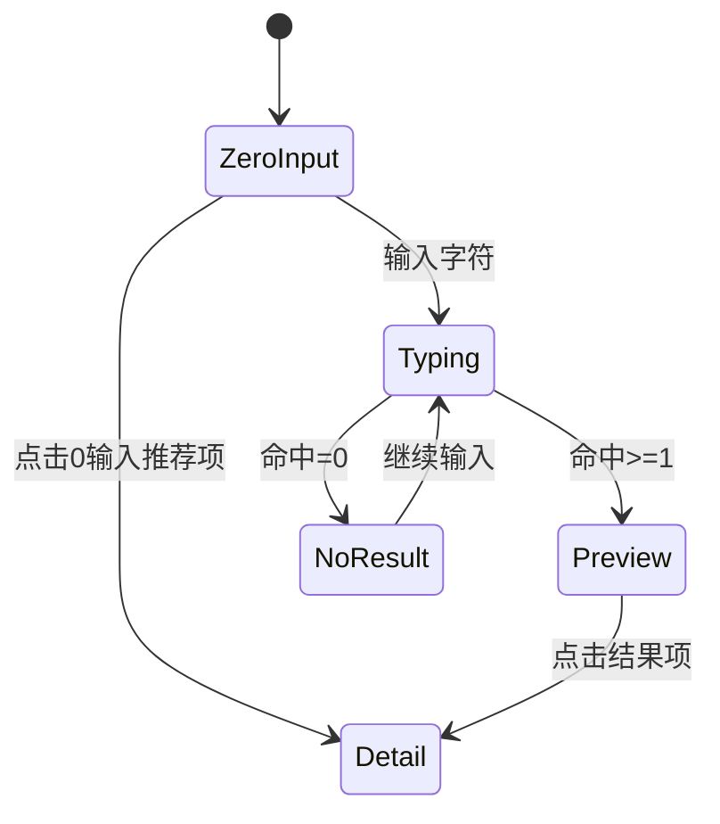

# K12 课后延时教育 APP - 产品原型交互与开发说明

> 版本：v1.7
> 更新日期：2026-02-17
> 对齐基准：`/Users/minxian/Documents/alex_project/InqAsst/Prototype.pen` + `前端原型设计开发说明.md(v1.6)`
> 文档性质：基于原型图的开发说明（可直接用于后续正式文档编制）

---

## 一、项目概述

### 1.1 项目背景

本应用服务于一家 K12 课后延时教育公司，主要业务是为中小学生（1-9年级）提供放学后的非学科类选修课（科创、人文、体育、劳作、艺术）。

**核心痛点**：
1. "走班制"模式下，外部上课老师和学生找不到上课地点（教室/操场）
2. 学生考勤管理分散，老师和管理员缺乏统一的考勤工具

**核心功能**：
1. **地点查询与指引**：快速、精准定位上课地点
2. **考勤管理**：老师现场点名 + 管理员统一监控与补录

### 1.2 用户角色

| 角色 | 说明 | 界面定位 |
|------|------|----------|
| 外部上课老师 (Teacher) | 非本校员工，不熟悉校园地形，可能跨校区上课 | 智能行程单 + 课堂点名 |
| 校区管理老师 (Admin) | 负责现场管控，解决突发状况，监控考勤情况 | 全能搜索台 + 考勤总控 |

**角色职责对比**

| 职责 | 外部老师 | 管理老师 |
|------|----------|----------|
| 查看课程安排 | ✅ 自己的课程 | ✅ 全校区课程 |
| 查看上课地点 | ✅ | ✅ |
| 搜索学生/老师/课程 | ❌ | ✅ |
| 课堂点名 | ✅ 上课时间段内 | ✅ 课前仅请假 + 上课时间段 + 当天补录（至23:59:59） |
| 标记请假 | ✅ | ✅ |
| 修改考勤记录 | ✅ 上课时间段内 | ✅ 可覆盖老师记录 |
| 查看考勤统计 | ✅ 自己的课程 | ✅ 全校区课程 |
| 管理学生标签 | ❌ | ✅ |

### 1.3 账号体系

- **登录方式**：手机号 + 短信验证码
- **角色区分**：根据账号角色自动切换至不同界面
- **数据范围**：账号绑定校区，只能查看本校区数据

---

## 二、全局设计规范

### 2.1 设计原则

- **极简信息架构**：减少用户操作步骤
- **高容错率**：支持模糊搜索、拼音缩写
- **上帝视角**：管理端可快速定位任何人/课程

### 2.2 地点格式标准

统一采用层级化文本格式：

```
楼栋 > 楼层 > 教室号
```

示例：**综合楼 A 栋 > 3 层 > 305 教室**

- 字号需醒目（建议 18-20px，加粗）
- 使用独立色块容器突出显示

### 2.3 五色分类系统

采用五色标签/图标系统对应五大课程类别：

| 类别 | 颜色 | 色值建议 | 图标建议 |
|------|------|----------|----------|
| 科创 | 蓝色系 | `#2196F3` | 齿轮/机器人 |
| 人文 | 青色系 | `#00BCD4` | 书本/笔 |
| 体育 | 橙色系 | `#FF9800` | 足球/跑步 |
| 劳作 | 绿色系 | `#4CAF50` | 树叶/工具 |
| 艺术 | 紫色系 | `#9C27B0` | 调色板/音符 |

### 2.4 默认头像规则

- 有照片：显示照片（圆形裁剪）
- 无照片：显示默认头像（可按性别区分图标）

---

## 三、页面结构总览

### 3.1 老师端页面结构

```
├── 登录页 (Login)
├── 首页 (Teacher_Home)
│   ├── 顶部导航区
│   │   ├── 用户信息
│   │   └── 周历切换器
│   ├── 今日行程区（标题 + 课程卡）
│   ├── 明日行程信息条
│   └── 无课状态卡片（独立变体）
├── 考勤页 (Teacher_Attendance)
│   └── 当日课程列表
├── 点名页 (Teacher_RollCall)
│   └── 课程学生名单（状态可编辑）
├── 我的 (Teacher_Profile)
│   ├── 基础信息
│   └── 退出登录
└── 弹窗/浮层
    ├── 点名提交弹窗（3态）
    ├── 学生名单弹窗（独立原型页）
    └── 退出登录确认弹窗
```

### 3.2 管理端页面结构

```
├── 登录页 (Login) [共用]
├── 首页 (Admin_Home)
│   ├── 超级搜索框
│   ├── 类别筛选 + 年级筛选
│   ├── 搜索预览列表（独立原型页）
│   └── 结果详情卡片区（课程卡含「班级名单」入口）
├── 名单 (Admin_List)
│   ├── 日期选择器
│   ├── 课程筛选器（考勤状态）
│   ├── 类别/年级筛选器
│   └── 课程列表（含考勤统计 + 班级名单入口）
├── 管理端学生名单页 (Admin_StudentList)
│   └── 课程学生名单（页面：筛选 + 状态编辑 + 标签编辑 + 标记请假）
├── 我的 (Admin_Profile)
│   ├── 基础信息
│   ├── 标签管理入口
│   └── 退出登录
└── 独立详情页
    └── 搜索结果详情页-学生
```

---

## 四、登录页设计

### 4.1 页面布局

```
┌─────────────────────────────┐
│                             │
│         [APP Logo]          │
│        应用名称/Slogan       │
│                             │
├─────────────────────────────┤
│                             │
│   ┌─────────────────────┐   │
│   │ 📱 请输入手机号       │   │
│   └─────────────────────┘   │
│                             │
│   ┌───────────────┬─────┐   │
│   │ 请输入验证码    │获取  │   │
│   └───────────────┴─────┘   │
│                             │
│   ┌─────────────────────┐   │
│   │       登 录          │   │
│   └─────────────────────┘   │
│                             │
│      □ 已阅读并同意《用户协议》 │
│                             │
└─────────────────────────────┘
```

### 4.2 交互说明

| 元素 | 交互行为 |
|------|----------|
| 手机号输入框 | 11位数字，自动校验格式 |
| 获取验证码按钮 | 点击后60秒倒计时，期间置灰不可点 |
| 验证码输入框 | 4-6位数字 |
| 登录按钮 | 手机号+验证码均填写后可点击 |
| 用户协议 | 必须勾选才能登录 |

### 4.3 登录成功后

- 根据账号角色自动跳转至对应首页
- 外部老师 → Teacher_Home
- 管理老师 → Admin_Home

---

## 五、老师端页面详细设计

### 5.1 首页 (Teacher_Home)

#### 5.1.1 页面布局

```
┌─────────────────────────────┐
│  [头像] 李老师，下午好         │ ← 顶部用户信息
├─────────────────────────────┤
│  第3周                    ▼  │ ← 周次选择器
├─────────────────────────────┤
│  一   二   三   四   五       │ ← 周历切换器
│       ●        ●            │   (●表示有课)
│      [今天]                  │
├─────────────────────────────┤
│ ● 今日行程            [优先] │ ← 今日任务标题
├─────────────────────────────┤
│ ┌─────────────────────────┐ │
│ │ 📍 嘉祥成华小学          │ │ ← 校区标识（深色通栏）
│ ├─────────────────────────┤ │
│ │  16:30 - 17:30          │ │
│ │  无人机飞行 A班 ✈️        │ │
│ │ ┌─────────────────────┐ │ │
│ │ │科技楼 > 2层 > 205教室│ │ │
│ │ └─────────────────────┘ │ │
│ │ [开始点名] [联系管理老师] │ │
│ └─────────────────────────┘ │
├─────────────────────────────┤
│  🗓 明日行程                 │
│  锦江校区 · 16:30 无人机A班   │
│                             │
├─────────────────────────────┤
│  [首页]    [考勤]    [我的]   │ ← 底部Tab导航（3个Tab）
└─────────────────────────────┘
```

#### 5.1.2 顶部导航区

**用户信息**
- 左侧显示用户头像（圆形，40px）
- 右侧显示欢迎语，根据时间动态变化：
  - 6:00-12:00：「XX老师，上午好」
  - 12:00-18:00：「XX老师，下午好」
  - 18:00-24:00：「XX老师，晚上好」

**周次选择器**
- 显示当前周次（如「第3周」）
- 点击弹出下拉选择器，可选择第1周~第15周
- 选择后刷新下方周历和课程卡片

**周历切换器**
- 横向排列周一至周五（周末不显示）
- 默认选中「今天」，高亮显示
- 有排课的日期下方显示蓝色圆点标记
- 点击不同日期，下方任务卡片内容刷新

#### 5.1.3 任务卡片 (Mission Card)

**卡片眉部 - 校区标识**
- 通栏深色背景（建议 `#333` 或主题深色）
- 显示 📍 图标 + 校区名称
- 字号 14px，白色字体

**卡片主体 - 课程信息**
- 背景色：根据课程类别显示淡色背景（透明度 10-15%）
- 第一行：
  - 时间：`16:30 - 17:30`（24px，加粗）
  - 课程名：`无人机飞行 A班` + 类别图标
- 第二行（地点 - 视觉焦点）：
  - 独立色块容器（浅灰背景 `#F5F5F5`）
  - 层级文本：`科技楼 > 2层 > 205教室`（18px，加粗）

**卡片底部 - 操作区**
- 两个并排按钮：
  - 「开始点名」：进入老师端点名页
  - 「联系管理老师」：显示对应管理老师姓名，点击直接拨号

#### 5.1.4 明日行程信息条

- 展示内容：`校区 + 时间 + 课程`
- 推荐样式：紧随今日行程卡下方，弱化视觉层级但保持可见
- 作用：帮助老师提前规划次日出行

#### 5.1.5 空状态

当选中日期无课时显示：
- 居中插画图标
- 文案：「该日无教学安排」
- 辅助文案：「可查看下方明日行程，提前规划到校」
- 灰色字体，16px

#### 5.1.6 学生名单弹窗

**原型状态**：独立原型页保留，用于学生信息核验展示

**弹窗内容**：
```
┌─────────────────────────────┐
│  无人机飞行 A班 名单    [关闭] │
├─────────────────────────────┤
│  应到：25人                  │
├─────────────────────────────┤
│  ┌─────────────────────────┐│
│  │[照片] 张三               ││
│  │       3年级2班 | 班主任:王某││
│  │       ⚠️ 调皮，需关注     ││ ← 特殊标记（如有）
│  └─────────────────────────┘│
│  ┌─────────────────────────┐│
│  │[照片] 李四               ││
│  │       3年级5班 | 班主任:刘某││
│  │       📚 第2次报此课程    ││ ← 历史报课
│  └─────────────────────────┘│
│  ...                        │
└─────────────────────────────┘
```

**名单项信息**：
- 学生照片（无照片显示默认头像）
- 学生姓名
- 行政班级
- 班主任姓名
- 特殊标记（如有，突出显示）
- 历史报课信息（如：第N次报此课程）

### 5.2 考勤页 (Teacher_Attendance)

#### 5.2.1 页面布局

```
┌─────────────────────────────┐
│           考勤               │
├─────────────────────────────┤
│  今天 2026-02-05 (周四)      │ ← 日期显示
├─────────────────────────────┤
│                             │
│  ┌─────────────────────────┐│
│  │ [科创] 乐高机器人 A班     ││
│  │ 16:30-17:30 | 科技楼205  ││
│  │ ✅已到20 🔴请假2 ❌缺勤1 ⚪未点2││ ← 考勤统计
│  │              [开始点名 >] ││ ← 仅上课时间段显示
│  └─────────────────────────┘│
│                             │
│  ┌─────────────────────────┐│
│  │ [体育] 足球 U8班         ││
│  │ 17:30-18:30 | 北操场3号区 ││
│  │ 课前仅可请假             ││ ← 非上课时间段
│  └─────────────────────────┘│
│                             │
├─────────────────────────────┤
│  [首页]    [考勤]    [我的]   │
└─────────────────────────────┘
```

#### 5.2.2 课程列表项状态

| 状态 | 显示内容 | 操作 |
|------|----------|------|
| 未开始 | 显示「课前仅可请假」灰色文字 | 不可点名，仅允许请假 |
| 进行中 | 显示考勤统计 + 「开始点名」按钮 | 可点名 |
| 已结束 | 显示考勤统计（只读） | 不可修改 |

#### 5.2.3 点名页面

**触发方式**：点击课程列表项的「开始点名」按钮

**页面布局**
```
┌─────────────────────────────┐
│  ←  乐高机器人 A班 点名       │
├─────────────────────────────┤
│  应到：25人                  │
│  ✅已到20 🔴请假2 ❌缺勤1 ⚪未点2│ ← 实时统计
├─────────────────────────────┤
│  ┌─────────────────────────┐│
│  │[照片] 张三       [⚪未点▼]││ ← 状态选择器
│  │       3年级2班           ││
│  │       ⚠️ 调皮，需关注     ││
│  └─────────────────────────┘│
│  ┌─────────────────────────┐│
│  │[照片] 李四       [✅已到▼]││ ← 已标记已到
│  │       3年级5班           ││
│  │       📚 第2次报此课程    ││
│  └─────────────────────────┘│
│  ┌─────────────────────────┐│
│  │[照片] 王五       [🔴请假▼]││ ← 管理端提前标记
│  │       4年级1班           ││
│  └─────────────────────────┘│
│  ...                        │
├─────────────────────────────┤
│     [完成点名（未点2）]       │ ← 底部按钮
└─────────────────────────────┘
```

**状态选择器交互**
- 点击状态标签弹出选择菜单：
  ```
  ┌─────────────┐
  │ ✅ 已到      │
  │ 🔴 请假      │
  │ ❌ 缺勤      │
  │ ⚪ 未点名    │
  └─────────────┘
  ```
- 选择后立即更新状态，顶部统计实时刷新

#### 5.2.4 点名操作说明

**状态说明**
| 状态 | 图标 | 说明 |
|------|------|------|
| 已到 | ✅ | 学生已到场 |
| 请假 | 🔴 | 学生请假（可由管理端提前标记，老师也可标记） |
| 缺勤 | ❌ | 学生缺勤（未到且未请假） |
| 未点名 | ⚪ | 默认状态，尚未进行标记 |

**操作逻辑**
- 所有学生默认状态为「未点名」
- 管理端提前标记的「请假」学生会显示请假状态
- 老师可以修改任何学生的状态（包括管理端标记的请假）
- 每次状态变更实时保存
- 管理端修订后，老师端在对应学生的考勤状态下方展示「管理员已修订」标识

**完成点名**
- 点击「完成点名」按钮
- 完成判定口径：`unmarked_count == 0`（与是否点击按钮无关）
- 按实时统计进入 3 种弹窗态：
  - `未点名 > 0`：阻断提交，提示未点名人数与姓名，仅提供「继续点名」
  - `未点名 = 0 且 缺勤+请假 > 0`：展示缺勤/请假人数与姓名，按钮为「修改点名」「完成点名」
  - `未点名 = 0 且 缺勤 = 0 且 请假 = 0`：显示「班级全勤（应到X人，实到X人）」，按钮为「修改点名」「完成点名」
- 选择「完成点名」后返回考勤列表页

**操作时机限制**
- 课前：仅允许标记请假
- 上课时间段内：老师与管理员均可编辑
- 课后当天（截止 `23:59:59`）：仅管理员可补录/修改
- 次日及以后：考勤记录只读

### 5.3 我的页面 (Teacher_Profile)

#### 5.3.1 页面布局

```
┌─────────────────────────────┐
│           我的               │
├─────────────────────────────┤
│                             │
│         [大头像]             │
│          李老师              │
│       138****1234           │
│         外部老师             │
│                             │
├─────────────────────────────┤
│                             │
│   ┌─────────────────────┐   │
│   │      退出登录         │   │
│   └─────────────────────┘   │
│                             │
├─────────────────────────────┤
│  [首页]    [考勤]    [我的]   │
└─────────────────────────────┘
```

#### 5.3.2 信息说明

| 字段 | 说明 |
|------|------|
| 头像 | 圆形，80px，来自后台数据 |
| 姓名 | 用户真实姓名 |
| 手机号 | 脱敏显示（138****1234） |
| 角色 | 显示「外部老师」 |
| 退出登录 | 点击后清除登录态，返回登录页 |

---

## 六、管理端页面详细设计

### 6.1 首页 (Admin_Home)

#### 6.1.1 页面布局

```
┌─────────────────────────────┐
│  [头像] 成华校区 - 张管理      │ ← 顶部信息
├─────────────────────────────┤
│ ┌─────────────────────────┐ │
│ │🔍 搜学生/老师/课程（汉字/全拼/首字母）│ │ ← 超级搜索框
│ └─────────────────────────┘ │
├─────────────────────────────┤
│ 全部 科创 人文 体育 劳作 艺术  │ ← 筛选器第一排：类别
├─────────────────────────────┤
│ 全部 1年级 ... 6年级 7-9年级 │ ← 筛选器第二排：年级
├─────────────────────────────┤
│                             │
│  [搜索结果 / 筛选结果区域]     │
│                             │
│  ┌─────────────────────────┐│
│  │ 结果卡片1                ││
│  └─────────────────────────┘│
│  ┌─────────────────────────┐│
│  │ 结果卡片2                ││
│  └─────────────────────────┘│
│                             │
├─────────────────────────────┤
│  [首页]    [名单]    [我的]   │ ← 底部Tab导航
└─────────────────────────────┘
```

#### 6.1.2 超级搜索框 (Omni-Search)

**基本属性**
- Placeholder：`搜学生/老师/课程（汉字/全拼/首字母）`
- 支持输入：汉字、拼音全拼、拼音首字母缩写
- 匹配对象：学生姓名、老师姓名、课程名称均支持上述三种输入方式

**交互逻辑**
1. 用户每输入 1 个字符即触发即时联想（Type-ahead）
2. 同步匹配学生库、教师库、课程库（汉字/全拼/首字母并行匹配）
3. 键盘上方弹出半屏预览列表
4. 列表项带身份标签区分类型

**预览列表样式**
```
┌─────────────────────────────┐
│ 搜索 "ljs" 的结果：           │
├─────────────────────────────┤
│ 全部 学生 课程 老师            │
├─────────────────────────────┤
│ [学生] 李嘉盛 —— 班主任：王某某 │
│ [学生] 林嘉树 —— 班主任：周某某 │
│ [老师] 刘俊生 —— 酷思｜乐高机器人│
│ [课程] 乐高竞赛班 —— 5-6年级   │
└─────────────────────────────┘
```

- 示例说明：输入 `ljs` 可同时命中学生与老师；输入 `lg` 可命中课程（如“乐高竞赛班”）

**无结果状态**
- 显示：「未找到相关结果，请检查拼写或尝试其他关键词」

#### 6.1.3 超级搜索框 v2 交互规范（体验增强）

本节为在当前原型基础上的交互增强规范，用于后续迭代实现。

**状态图**


**0输入态推荐（你确认的规则）**
- 触发条件：搜索框为空且获得焦点
- 展示策略：按课程类别分组（科创/人文/体育/劳作/艺术），每个类别推荐 1 条
- 推荐规则：在当前校区内，取“班级人数最多”的课程对应老师/班级
- 展示文案格式：`[类别] 老师名 · 课程名（XX人）`
- 并列时排序：`正在上课` > `即将开始` > `开始时间更早` > `最近被点击`
- 点击行为：直接进入对应结果详情卡（学生/老师/课程）

**输入态结果排序规则**
1. 精确命中（汉字全等）优先
2. 前缀命中（汉字前缀 / 拼音全拼前缀 / 首字母前缀）
3. 包含命中（汉字包含 / 拼音包含）
4. 场景加权：`正在上课` 与 `即将开始`结果前置
5. 同分时按课程开始时间升序，再按最近点击排序

**交互与文案规范**
- Placeholder：`搜学生/老师/课程（汉字/全拼/首字母）`
- 0输入标题：`推荐检索`
- 0输入分组标题：`各类别最多人数班级`
- 空结果文案：`未找到相关结果，试试姓名拼音或课程关键词`
- 示例提示：`例如：ljs / lgjs / 足球 / 王力`

#### 6.1.4 筛选器 (Filter)

**第一排：课程类别**
- 选项：`全部` `科创` `人文` `体育` `劳作` `艺术`
- 默认选中「全部」
- 单选，点击切换

**第二排：年级**
- 选项：`全部` `1年级` `2年级` `3年级` `4年级` `5年级` `6年级` `7-9年级`
- 默认选中：`全部`
- 单选，点击切换

**筛选逻辑**
- 筛选器可与搜索框组合使用
- 筛选结果实时更新到下方列表
- 可筛选学生、老师、课程三种类型

#### 6.1.5 默认显示内容

**进入首页时的默认状态**
- 搜索框为空
- 筛选器默认选中「全部」
- 结果区域默认显示**当日所有课程列表**
- 课程按上课时间排序
- 注：0输入态推荐属于 v2 增强能力，当前原型尚未展开展示

**设计原因**
- 管理员打开 APP 最常见需求是「看看今天有什么课」
- 提供有用的默认内容，减少操作步骤
- 与名单页形成互补（首页是快速概览+搜索，名单页是考勤详情）

#### 6.1.6 结果详情卡片

根据选中对象类型，显示不同的卡片结构：

**卡片类型一：学生卡片**

```
┌─────────────────────────────┐
│ [学生照片]  李景行            │
│  (60x60)   5年级3班          │
│            班主任：王某某      │
├─────────────────────────────┤
│  ▼ 校验信息（点击展开）        │ ← 默认折叠
│  ┌─────────────────────────┐│
│  │ 班主任：王某某            ││
│  │ 生日：08-12              ││
│  └─────────────────────────┘│
├─────────────────────────────┤
│  课程：乐高机器人 [科创标签]    │
│ ┌─────────────────────────┐ │
│ │ 科技楼A栋 > 2层 > 205    │ │ ← 地点突出
│ │                    [导航] │ │
│ └─────────────────────────┘ │
└─────────────────────────────┘
```

**卡片类型二：老师卡片**

```
┌─────────────────────────────┐
│ [老师照片]  王力        [📞]  │ ← 电话图标可点击
│  (60x60)   某某机构签约教师   │
├─────────────────────────────┤
│  状态：正在上课 / 即将开始     │
│  课程：无人机飞行 A班         │
│ ┌─────────────────────────┐ │
│ │ 科技楼A栋 > 2层 > 205    │ │
│ │                    [导航] │ │
│ └─────────────────────────┘ │
└─────────────────────────────┘
```

**卡片类型三：课程卡片**

```
┌─────────────────────────────┐
│ [类别图标]  乐高机器人 A班     │
│  (科创蓝)  16:30 - 17:30     │
│            应到：25人         │
├─────────────────────────────┤
│  授课教师：王力         [📞]  │
│ ┌─────────────────────────┐ │
│ │ 科技楼A栋 > 2层 > 205    │ │
│ │                    [导航] │ │
│ └─────────────────────────┘ │
│        [班级名单 >]          │ ← 进入管理端学生名单页
└─────────────────────────────┘
```

**课程卡片操作**
- 点击「班级名单」按钮，进入管理端学生名单页（页面化，不使用弹窗）

### 6.2 名单页 (Admin_List)

#### 6.2.1 页面布局（重新设计）

**设计定位**：以课程为主入口的当日总览工具

```
┌─────────────────────────────┐
│  名单          2026-02-05 ▼  │ ← 日期选择器
├─────────────────────────────┤
│ ┌─────────────────────────┐ │
│ │🔍 搜索课程...            │ │ ← 课程搜索
│ └─────────────────────────┘ │
├─────────────────────────────┤
│ 全部 | 有未点名 | 已完成 | 有缺勤 │ ← 考勤状态筛选
├─────────────────────────────┤
│ 全部 科创 人文 体育 劳作 艺术  │ ← 类别筛选
│ 小低(1-3) | 小高(4-6) | 初中   │ ← 年级筛选
├─────────────────────────────┤
│                             │
│  ┌─────────────────────────┐│
│  │ [科创] 乐高机器人 A班     ││
│  │ 16:30-17:30 | 科技楼205  ││
│  │ 已到20 请假2 缺勤1 未点2  ││ ← 考勤统计
│  │      [班级名单 >]         ││
│  └─────────────────────────┘│
│  ┌─────────────────────────┐│
│  │ [体育] 足球 U8班         ││
│  │ 16:30-17:30 | 北操场3号区 ││
│  │ 已到15 请假1 缺勤0 未点2  ││
│  │      [班级名单 >]         ││
│  └─────────────────────────┘│
│  ...                        │
│                             │
├─────────────────────────────┤
│  [首页]    [名单]    [我的]   │
└─────────────────────────────┘
```

#### 6.2.2 日期选择器

- 默认显示「今天」的日期
- 点击弹出日期选择器
- 可选择昨天、今天、明天、后天等日期
- 选择后刷新下方课程列表

#### 6.2.3 考勤状态筛选器

**筛选选项**

| 筛选项 | 说明 | 筛选逻辑 |
|--------|------|----------|
| 全部 | 显示所有课程 | 默认选中，无筛选 |
| 有未点名 | 存在未点名学生的课程 | `unmarked_count > 0` |
| 已完成 | 考勤已全部完成的课程 | `unmarked_count == 0` |
| 有缺勤 | 存在缺勤学生的课程 | `absent_count > 0` |

**交互说明**
- 采用横向滑动的 Tab 形式
- 单选，默认选中「全部」
- 切换筛选项时实时刷新列表
- 筛选结果为空时显示空状态提示
- 已完成判定与「完成点名」按钮点击无关，仅看 `unmarked_count == 0`

**视觉样式**
- 选中状态：主色调背景 + 白色文字
- 未选中状态：透明背景 + 灰色文字
- 各筛选项后可显示数量角标（如「有未点名 (5)」）

#### 6.2.4 类别与年级筛选器

**类别筛选**

| 选项 | 说明 |
|------|------|
| 全部 | 显示所有类别课程（默认） |
| 科创 | 只显示科创类课程 |
| 人文 | 只显示人文类课程 |
| 体育 | 只显示体育类课程 |
| 劳作 | 只显示劳作类课程 |
| 艺术 | 只显示艺术类课程 |

**年级筛选**

| 选项 | 年级范围 | 说明 |
|------|----------|------|
| 全部 | 1-9年级 | 显示所有年级课程（默认） |
| 小低 | 1-3年级 | 小学低年级 |
| 小高 | 4-6年级 | 小学高年级 |
| 初中 | 7-9年级 | 初中年级 |

**交互说明**
- 类别和年级筛选可组合使用
- 与考勤状态筛选器叠加生效
- 例如：选择「有未点名」+「体育」+「小低」= 显示小低年级体育课中有未点名学生的课程

#### 6.2.5 课程列表项

**列表项结构**
```
┌─────────────────────────────┐
│ [类别图标] 乐高机器人 A班     │
│ 16:30-17:30 | 科技楼205     │
│ ✅20  🔴请假2  ❌缺勤1  ⚪未点2 │ ← 考勤统计
│      [班级名单 >]            │ ← 课程级操作入口
└─────────────────────────────┘
```

**考勤统计说明**
- ✅ 已到：绿色，显示已到人数
- 🔴 请假：橙色，显示请假人数
- ❌ 缺勤：红色，显示缺勤人数
- ⚪ 未点名：灰色，显示未点名人数

**点击行为**：点击「班级名单」按钮进入课程学生名单页

**排序方式**：按上课时间排序

#### 6.2.6 课程学生名单页（管理端页面）

**触发方式**：点击首页/名单页课程卡片中的「班级名单」按钮

**页面布局**
```
┌─────────────────────────────┐
│  ←  乐高竞赛班5-6 班级名单    │
├─────────────────────────────┤
│  应到：25人                  │
│  ✅已到20 🔴请假2 ❌缺勤1 ⚪未点2│ ← 统计概览
├─────────────────────────────┤
│  筛选：全部 未点名 请假 缺勤 特殊标记│ ← 筛选器
├─────────────────────────────┤
│  课前仅可请假 | 课后补录至23:59:59 │
│  支持编辑：考勤状态 + 学生标签      │
├─────────────────────────────┤
│  ┌─────────────────────────┐│
│  │[照片] 张三       [✅已到▼]││ ← 考勤状态可编辑
│  │       3年级2班           ││
│  │       ⚠️ 调皮，需关注     ││
│  │       编辑标签            ││
│  └─────────────────────────┘│
│  ┌─────────────────────────┐│
│  │[照片] 李四       [🔴请假▼]││
│  │       3年级5班           ││
│  │       📚 第2次报此课程    ││
│  │       🏷 添加标签         ││
│  └─────────────────────────┘│
│  ┌─────────────────────────┐│
│  │[照片] 王五       [⚪未点▼]││
│  │       4年级1班           ││
│  │       🏷 添加标签         ││
│  └─────────────────────────┘│
│  ...                        │
├─────────────────────────────┤
│  已选0人                     │
│  [先选择学生再标记请假]       │ ← 底部考勤操作
│  [学生标签管理]              │ ← 底部标签入口
└─────────────────────────────┘
```

**学生列表项信息**
- 学生照片（无照片显示默认头像）
- 学生姓名
- 行政班级
- 班主任姓名
- 特殊标记（如有，突出显示）
- 历史报课信息
- 考勤状态标签（已到/请假/缺勤/未点名）
- 标签操作入口（编辑标签/添加标签）

**筛选器功能**
- 全部：显示所有学生
- 未点名：只显示未点名学生
- 请假：只显示请假学生
- 缺勤：只显示缺勤学生
- 特殊标记：只显示有特殊标记的学生

**考勤操作（管理端）**
- 点击学生的考勤状态标签可切换状态
- 管理端权限高于老师端，可修改老师已提交的考勤状态
- 例如：将请假改为已到、将缺勤改为请假等
- 操作时机：上课时间段内 + 课后当天可补录（截至 `23:59:59`）
- 课前不能操作（请假除外）
- 不允许把已标记学生改回「未点名」

**标记请假功能**
- 先在学生列表中选择目标学生（显示已选人数）
- 点击底部「先选择学生再标记请假」按钮后执行批量请假标记
- 确认后将选中学生标记为「请假」

**学生标签编辑**
- 管理员可在学生行内点击「编辑标签/添加标签」维护标签
- 点击底部「学生标签管理」可进入标签配置入口
- 标签编辑结果需同步展示给授课老师（老师端点名页可见）

---

### 6.3 我的页面 (Admin_Profile)

#### 6.3.1 页面布局

```
┌─────────────────────────────┐
│           我的               │
├─────────────────────────────┤
│                             │
│         [大头像]             │
│          张管理              │
│       138****5678           │
│       成华校区 - 管理老师     │
│                             │
├─────────────────────────────┤
│ ┌─────────────────────────┐ │
│ │ 📋 标签管理            > │ │ ← 管理端特有
│ └─────────────────────────┘ │
├─────────────────────────────┤
│ ┌─────────────────────────┐ │
│ │      退出登录             │ │
│ └─────────────────────────┘ │
├─────────────────────────────┤
│  [首页]    [名单]    [我的]   │
└─────────────────────────────┘
```

#### 6.3.2 标签管理页面

**入口**：我的页面 > 标签管理

**功能**：配置特殊学生标记的预设分类

**页面布局**
```
┌─────────────────────────────┐
│  ←  标签管理                 │
├─────────────────────────────┤
│                             │
│  已有标签：                   │
│  ┌─────────────────────────┐│
│  │ ⚠️ 调皮           [删除] ││
│  └─────────────────────────┘│
│  ┌─────────────────────────┐│
│  │ 💊 身体特殊        [删除] ││
│  └─────────────────────────┘│
│  ┌─────────────────────────┐│
│  │ 😢 情绪敏感        [删除] ││
│  └─────────────────────────┘│
│                             │
│  ┌─────────────────────────┐│
│  │      + 添加新标签        ││
│  └─────────────────────────┘│
│                             │
└─────────────────────────────┘
```

**交互说明**
- 点击「添加新标签」弹出输入框
- 输入标签名称后保存
- 点击「删除」移除标签（需二次确认）

---

## 七、交互流程场景

### 7.1 场景一：管理员帮助迷路学生

**背景**：学生口齿不清，只能听清拼音首字母“ljs”

**操作流程**：
1. 管理员在搜索框输入 `ljs`
2. 预览列表出现 `李嘉盛` 和 `林嘉树`（并出现同首字母老师结果）
3. 管理员根据外貌判断，点击 `李嘉盛`
4. 卡片弹出，管理员看照片确认长相
5. 展开校验信息，问："你班主任姓什么？" 学生答："姓王" —— 身份确认
6. 管理员指引："去科技楼 205 教室"

### 7.2 场景二：管理员帮助未带工牌的老师

**背景**：遇到一位陌生老师，自称姓王，来上"飞机课"

**操作流程**：
1. 管理员在搜索框输入 `王`
2. 预览列表出现多位姓王的学生和老师
3. 管理员点击 `[老师] 王力 - 无人机课程`
4. 卡片显示该老师需前往 **科技楼 205**
5. 如老师迟迟未到，管理员可直接点击电话图标催促

### 7.3 场景三：管理员巡课或家长询问

**背景**：家长问"今天的足球课在哪上？"

**操作流程**：
1. 管理员在搜索框输入 `足球`
2. 预览列表显示 `[课程] 足球 U8 班` 和 `[课程] 足球 U10 班`
3. 点击 `U8 班`
4. 卡片显示 **北操场 3 号区**，以及 **张教练** 的电话
5. 管理员可进入对应课程学生名单页核对到课情况

### 7.4 场景四：外部老师自查行程

**背景**：老师周一晚上在家打开 App，想确认明天的安排

**操作流程**：
1. 老师打开 App，默认显示今天（周一）的课程
2. 点击顶部周历的「周二」
3. 卡片显示 **明天 (周二) - 锦江校区 - 16:30**
4. 老师明确了明天要去的校区和时间，提前安排出行

### 7.5 场景五：管理员标记特殊学生

**背景**：管理员发现某学生上课经常捣乱，需要标记提醒老师

**操作流程**：
1. 管理员在首页搜索框输入学生姓名或拼音
2. 在搜索结果中点击该学生，弹出学生详情卡片
3. 点击「添加标记」按钮
4. 选择预设分类「调皮」，补充备注「上课爱说话，需要坐前排」
5. 保存后，该学生在所有名单中都会显示此标记
6. 上课老师在点名页/学生名单页可看到此标记

### 7.6 场景六：老师上课点名

**背景**：老师到达教室，开始上课，需要点名

**操作流程**：
1. 老师打开 App，点击底部「考勤」Tab
2. 看到今天的课程列表，当前课程显示「开始点名」按钮
3. 点击「开始点名」进入点名页面
4. 老师看到张三旁边有「🔴 已请假」标记，知道他今天请假了
5. 老师逐个勾选到场的学生
6. 点名完成后点击「完成点名」按钮
7. 如果有未勾选的学生，弹出提醒：「还有 2 名学生未点名：王五、赵六」
8. 老师确认无误后选择「完成点名」，返回考勤列表页

### 7.7 场景七：管理员查看当日考勤情况

**背景**：管理员想了解今天各课程的考勤情况

**操作流程**：
1. 管理员进入「名单」Tab
2. 默认显示今天的所有课程列表
3. 每个课程显示考勤统计：「已到20 请假2 缺勤1 未点2」
4. 管理员发现「乐高机器人 A班」有 2 人未点名
5. 点击该课程卡片中的「班级名单」按钮进入学生名单页
6. 筛选「未点名」学生，逐一确认情况
7. 将确认缺勤的学生标记为「缺勤」

### 7.8 场景八：管理员提前标记请假学生

**背景**：家长通过微信告知管理员，孩子今天请假

**操作流程**：
1. 管理员进入「名单」Tab
2. 点击对应课程卡片中的「班级名单」按钮
3. 在学生名单页中先选择请假的学生
4. 点击底部「先选择学生再标记请假」
5. 确认后，该学生被标记为「请假」
6. 上课老师查看名单时可以看到该学生的请假标记

---

## 八、Mock 数据结构

### 8.1 用户数据 (users.json)

**说明**：统一的用户数据结构，包含外部老师和管理老师两种角色。登录后根据 `role` 字段区分界面。

```json
{
  "users": [
    {
      "id": "teacher_001",
      "phone": "13900001111",
      "name": "王力",
      "namePinyin": "wangli",
      "nameAbbr": "wl",
      "role": "teacher",
      "avatar": "/images/avatars/teacher_001.jpg",
      "organization": "某某教育机构",
      "courseIds": ["course_001"],
      "schedules": [
        {
          "weekDay": 2,
          "campusId": "campus_001",
          "courseId": "course_001"
        }
      ]
    },
    {
      "id": "teacher_002",
      "phone": "13900002222",
      "name": "刘建新",
      "namePinyin": "liujianxin",
      "nameAbbr": "ljx",
      "role": "teacher",
      "avatar": null,
      "organization": "某某科技公司",
      "courseIds": ["course_002"],
      "schedules": [
        {
          "weekDay": 3,
          "campusId": "campus_001",
          "courseId": "course_002"
        },
        {
          "weekDay": 4,
          "campusId": "campus_002",
          "courseId": "course_005"
        }
      ]
    },
    {
      "id": "admin_001",
      "phone": "13800002222",
      "name": "张管理",
      "namePinyin": "zhangguanli",
      "nameAbbr": "zgl",
      "role": "admin",
      "avatar": "/images/avatars/admin_001.jpg",
      "campusId": "campus_001",
      "campusName": "成华校区",
      "responsibleCategories": ["科创", "人文"]
    },
    {
      "id": "admin_002",
      "phone": "13800003333",
      "name": "王管理",
      "namePinyin": "wangguanli",
      "nameAbbr": "wgl",
      "role": "admin",
      "avatar": "/images/avatars/admin_002.jpg",
      "campusId": "campus_001",
      "campusName": "成华校区",
      "responsibleCategories": ["体育", "艺术", "劳作"]
    }
  ]
}
```

**字段说明**

| 字段 | 类型 | 说明 | 适用角色 |
|------|------|------|----------|
| id | string | 用户唯一标识 | 全部 |
| phone | string | 手机号（登录凭证） | 全部 |
| name | string | 姓名 | 全部 |
| namePinyin | string | 姓名拼音全拼 | 全部 |
| nameAbbr | string | 姓名拼音首字母缩写 | 全部 |
| role | string | 角色：teacher/admin | 全部 |
| avatar | string/null | 头像路径 | 全部 |
| organization | string | 所属机构 | teacher |
| courseIds | array | 负责的课程ID列表 | teacher |
| schedules | array | 排课信息 | teacher |
| campusId | string | 所属校区ID | admin |
| campusName | string | 所属校区名称 | admin |
| responsibleCategories | array | 负责的课程类别 | admin |

### 8.2 校区数据 (campuses.json)

```json
{
  "campuses": [
    {
      "id": "campus_001",
      "name": "成华校区",
      "address": "成都市成华区XX路XX号",
      "adminTeachers": [
        {
          "id": "admin_001",
          "name": "张管理",
          "phone": "13800002222",
          "responsibleCategories": ["科创", "人文"]
        },
        {
          "id": "admin_002",
          "name": "王管理",
          "phone": "13800003333",
          "responsibleCategories": ["体育", "艺术", "劳作"]
        }
      ]
    },
    {
      "id": "campus_002",
      "name": "锦江校区",
      "address": "成都市锦江区XX路XX号",
      "adminTeachers": []
    }
  ]
}
```

### 8.3 学期周次数据 (semester.json)

```json
{
  "semester": {
    "id": "2025-2026-2",
    "name": "2025-2026学年第二学期",
    "totalWeeks": 15,
    "startDate": "2026-02-16",
    "currentWeek": 3,
    "holidays": [
      {
        "date": "2026-04-04",
        "name": "清明节"
      }
    ]
  }
}
```

### 8.4 课程分类数据 (categories.json)

```json
{
  "categories": [
    {
      "id": "tech",
      "name": "科创",
      "color": "#2196F3",
      "bgColor": "rgba(33, 150, 243, 0.1)",
      "icon": "robot"
    },
    {
      "id": "humanity",
      "name": "人文",
      "color": "#00BCD4",
      "bgColor": "rgba(0, 188, 212, 0.1)",
      "icon": "book"
    },
    {
      "id": "sports",
      "name": "体育",
      "color": "#FF9800",
      "bgColor": "rgba(255, 152, 0, 0.1)",
      "icon": "football"
    },
    {
      "id": "labor",
      "name": "劳作",
      "color": "#4CAF50",
      "bgColor": "rgba(76, 175, 80, 0.1)",
      "icon": "tools"
    },
    {
      "id": "art",
      "name": "艺术",
      "color": "#9C27B0",
      "bgColor": "rgba(156, 39, 176, 0.1)",
      "icon": "palette"
    }
  ]
}
```

### 8.5 课程数据 (courses.json)

```json
{
  "courses": [
    {
      "id": "course_001",
      "name": "乐高机器人 A班",
      "categoryId": "tech",
      "campusId": "campus_001",
      "teacherId": "teacher_001",
      "adminTeacherId": "admin_001",
      "schedule": {
        "weekDay": 2,
        "startTime": "16:30",
        "endTime": "17:30"
      },
      "location": {
        "building": "科技楼A栋",
        "floor": "2层",
        "room": "205教室",
        "fullText": "科技楼A栋 > 2层 > 205教室"
      },
      "studentCount": 25,
      "studentIds": ["stu_001", "stu_002", "stu_003"]
    },
    {
      "id": "course_002",
      "name": "无人机飞行 A班",
      "categoryId": "tech",
      "campusId": "campus_001",
      "teacherId": "teacher_002",
      "adminTeacherId": "admin_001",
      "schedule": {
        "weekDay": 3,
        "startTime": "16:30",
        "endTime": "17:30"
      },
      "location": {
        "building": "科技楼A栋",
        "floor": "3层",
        "room": "301教室",
        "fullText": "科技楼A栋 > 3层 > 301教室"
      },
      "studentCount": 20,
      "studentIds": ["stu_004", "stu_005"]
    },
    {
      "id": "course_003",
      "name": "足球 U8班",
      "categoryId": "sports",
      "campusId": "campus_001",
      "teacherId": "teacher_003",
      "adminTeacherId": "admin_002",
      "schedule": {
        "weekDay": 2,
        "startTime": "16:30",
        "endTime": "17:30"
      },
      "location": {
        "building": "北操场",
        "floor": "",
        "room": "3号区",
        "fullText": "北操场 > 3号区"
      },
      "studentCount": 18,
      "studentIds": ["stu_006", "stu_007"]
    }
  ]
}
```

> 搜索索引约定：课程对象需建立 `namePinyin` 与 `nameAbbr` 索引字段（可预计算入库或前端初始化时生成），用于支持课程名的全拼与首字母检索。

### 8.6 学生数据 (students.json)

```json
{
  "students": [
    {
      "id": "stu_001",
      "name": "李景行",
      "namePinyin": "lijinghang",
      "nameAbbr": "ljh",
      "gender": "male",
      "avatar": "/images/avatars/stu_001.jpg",
      "grade": 5,
      "classNumber": 3,
      "className": "5年级3班",
      "headTeacher": {
        "name": "王某某",
        "phone": "13800005555"
      },
      "birthday": "08-12",
      "campusId": "campus_001",
      "courseIds": ["course_001"],
      "courseHistory": [
        {
          "courseId": "course_001",
          "courseName": "乐高机器人 A班",
          "semester": "2025-2026-1"
        }
      ],
      "tags": [
        {
          "id": "tag_001",
          "name": "调皮",
          "remark": "上课爱说话，需要坐前排"
        }
      ]
    },
    {
      "id": "stu_002",
      "name": "李京星",
      "namePinyin": "lijingxing",
      "nameAbbr": "ljx",
      "gender": "female",
      "avatar": null,
      "grade": 4,
      "classNumber": 8,
      "className": "4年级8班",
      "headTeacher": {
        "name": "刘某某",
        "phone": "13800006666"
      },
      "birthday": "03-25",
      "campusId": "campus_001",
      "courseIds": ["course_001"],
      "courseHistory": [],
      "tags": []
    },
    {
      "id": "stu_003",
      "name": "张三",
      "namePinyin": "zhangsan",
      "nameAbbr": "zs",
      "gender": "male",
      "avatar": "/images/avatars/stu_003.jpg",
      "grade": 3,
      "classNumber": 2,
      "className": "3年级2班",
      "headTeacher": {
        "name": "王某",
        "phone": "13800007777"
      },
      "birthday": "11-08",
      "campusId": "campus_001",
      "courseIds": ["course_001", "course_003"],
      "courseHistory": [
        {
          "courseId": "course_001",
          "courseName": "乐高机器人 A班",
          "semester": "2025-2026-1"
        }
      ],
      "tags": []
    }
  ]
}
```

### 8.7 特殊标签配置 (tags.json)

```json
{
  "tags": [
    {
      "id": "tag_001",
      "name": "调皮",
      "icon": "⚠️",
      "campusId": "campus_001"
    },
    {
      "id": "tag_002",
      "name": "身体特殊",
      "icon": "💊",
      "campusId": "campus_001"
    },
    {
      "id": "tag_003",
      "name": "情绪敏感",
      "icon": "😢",
      "campusId": "campus_001"
    }
  ]
}
```

### 8.8 考勤记录数据 (attendance.json)

```json
{
  "attendanceRecords": [
    {
      "id": "att_001",
      "date": "2026-02-05",
      "courseId": "course_001",
      "campusId": "campus_001",
      "records": [
        {
          "studentId": "stu_001",
          "status": "present",
          "markedBy": "teacher_001",
          "markedAt": "2026-02-05T16:35:00"
        },
        {
          "studentId": "stu_002",
          "status": "leave",
          "markedBy": "admin_001",
          "markedAt": "2026-02-05T14:00:00",
          "remark": "家长请假"
        },
        {
          "studentId": "stu_003",
          "status": "absent",
          "markedBy": "admin_001",
          "markedAt": "2026-02-05T17:45:00"
        }
      ],
      "summary": {
        "total": 25,
        "present": 20,
        "leave": 2,
        "absent": 1,
        "unmarked": 2
      }
    }
  ]
}
```

**考勤状态说明**
| 状态值 | 中文 | 说明 |
|--------|------|------|
| present | 已到 | 学生已到场 |
| leave | 请假 | 学生请假（管理端提前标记） |
| absent | 缺勤 | 学生缺勤（未到且未请假） |
| unmarked | 未点名 | 尚未进行考勤标记 |

---

## 九、技术实现建议

### 9.1 推荐技术栈

| 类型 | 推荐方案 |
|------|----------|
| 框架 | React Native / Flutter / Taro (小程序) |
| 状态管理 | Redux / MobX / Zustand |
| UI组件库 | Ant Design Mobile / Vant |
| 路由 | React Navigation / 框架内置 |
| 网络请求 | Axios / Fetch |
| Mock数据 | Mock.js / JSON Server |

### 9.2 目录结构建议

```
src/
├── assets/              # 静态资源
│   ├── images/          # 图片
│   │   ├── avatars/     # 头像
│   │   └── icons/       # 图标
│   └── mock/            # Mock数据JSON文件
├── components/          # 公共组件
│   ├── MissionCard/     # 任务卡片
│   ├── StudentCard/     # 学生卡片
│   ├── TeacherCard/     # 老师卡片
│   ├── CourseCard/      # 课程卡片
│   ├── WeekCalendar/    # 周历切换器
│   ├── SearchInput/     # 搜索框
│   ├── FilterBar/       # 筛选器
│   └── ModalSheet/      # 弹窗/底部浮层
├── pages/               # 页面
│   ├── Login/           # 登录页
│   ├── Teacher/         # 老师端
│   │   ├── Home/        # 首页
│   │   ├── Attendance/  # 考勤
│   │   └── Profile/     # 我的
│   └── Admin/           # 管理端
│       ├── Home/        # 首页
│       ├── List/        # 名单
│       └── Profile/     # 我的
├── services/            # 数据服务
│   └── mockApi.js       # Mock API
├── store/               # 状态管理
├── utils/               # 工具函数
│   ├── pinyin.js        # 拼音处理
│   └── time.js          # 时间处理
└── App.js               # 入口文件
```

### 9.3 关键功能实现要点

**拼音搜索**
- 使用 pinyin.js 或类似库将汉字转换为拼音
- 预处理学生/老师/课程数据，生成拼音全拼和首字母缩写字段
- 搜索时同时匹配：汉字、拼音全拼、拼音首字母

**周历切换**
- 根据学期开始日期和当前日期计算当前周次
- 缓存已加载的周次数据，避免重复请求
- 切换周次/日期时平滑过渡动画

**电话拨号**
- 使用 `Linking.openURL('tel:13800001111')` 调起系统拨号
- 需要处理权限请求（如适用）

**超级搜索框 v2（体验增强）**
- 0输入态按类别推荐“班级人数最多”的老师/班级
- 排序遵循：精确命中 > 前缀命中 > 包含命中 + 场景时段加权
- 支持最近点击加权，提升重复检索效率

---

## 十、后续迭代规划（本期不实现）

以下功能已确认需要，但不在本期 MVP 范围内：

| 功能 | 说明 | 优先级 |
|------|------|--------|
| 巡课清单 | 管理端显示当前时段所有课程列表（独立入口） | P1 |
| 通知推送 | APP内通知（目前用微信） | P2 |
| 3D地图导航 | 接入第三方地图实现室内导航 | P2 |
| 数据统计 | 课程出勤率、老师评价等 | P3 |
| 老师到岗签到 | 记录外部老师到岗时间 | P3 |

**注意**：学生考勤功能已纳入本期 MVP。

---

## 十一、v1.7 对齐更新摘要（2026-02-17）

本次更新基于 `Prototype.pen` 与代码对齐版说明同步，关键调整如下：

1. 老师端首页主操作统一为「开始点名」，并补齐「今日行程 + 明日行程」结构说明。
2. 老师端点名逻辑补齐：三态提交弹窗、完成判定口径（`unmarked_count == 0`）与时段权限规则。
3. 管理端规则补齐：课前仅可请假、课后补录截至 `23:59:59`、状态不可回未点名。
4. 管理员修订提示规范调整为：仅在对应学生考勤状态下方标注。
5. 超级搜索框新增 v2 交互规范（状态图、排序规则、0输入态推荐与标准文案）。
6. 清理与当前原型不一致描述（校园平面图弹窗、班级动态筛选行等）。
7. 管理端课程卡片新增「班级名单」按钮，统一进入“管理端学生名单页”，并补齐“考勤状态+学生标签”可编辑说明。

---

## 附录：设计稿交付清单

前端工程师开发前需要设计师提供以下资源：

- [ ] 登录页视觉稿
- [ ] 老师端首页视觉稿
- [ ] 老师端考勤页（课程列表）视觉稿
- [ ] 老师端点名页（学生列表+勾选）视觉稿
- [ ] 老师端学生名单弹窗视觉稿
- [ ] 老师端我的页面视觉稿
- [ ] 管理端首页视觉稿
- [ ] 管理端名单页（课程列表）视觉稿
- [ ] 管理端课程学生名单页（页面版）视觉稿
- [ ] 管理端我的页面视觉稿
- [ ] 各类卡片组件视觉稿
- [ ] 弹窗/浮层视觉稿（含点名提交弹窗、退出登录确认）
- [ ] 空状态插画
- [ ] 默认头像图标（男/女）
- [ ] 五大类别图标
- [ ] 考勤状态图标（已到/请假/缺勤/未点名）
- [ ] 完整图标库（导航、电话、关闭等）

---

*文档结束*
